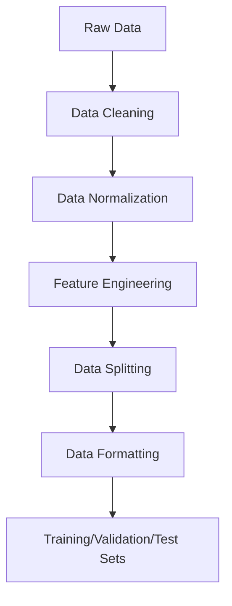

## Table of Contents
1. [Understand Your Data](#understand-your-data)
2. [Data Collection](#data-collection)
3. [Data Cleaning](#data-cleaning)
4. [Data Normalization/Scaling](#data-normalizationscaling)
5. [Feature Engineering](#feature-engineering)
6. [Data Splitting](#data-splitting)
7. [Data Formatting](#data-formatting)
8. [Data Augmentation (Optional)](#data-augmentation-optional)
9. [Save and Load Data](#save-and-load-data)
10. [Common Mistakes to Avoid](#common-mistakes-to-avoid)

---

## 1. Understand Your Data
Before you start, make sure you understand the structure and characteristics of your motion sensor data:

| **Characteristic** | **Description** |
|--------------------|-----------------|
| Time Series Nature | Motion sensor data is sequential, with measurements taken at regular time intervals. |
| Features           | Typically includes features like `x`, `y`, `z` coordinates, timestamps, and possibly additional metadata (e.g., device ID, user ID). |
| Missing Data       | Check for missing values or gaps in the data. |
| Noise              | Assess if the data contains noise or outliers. |

---

## 2. Data Collection
- **Raw Data**:
  - Collect raw motion sensor data from your devices (e.g., accelerometers, gyroscopes).
  - Ensure the data is recorded at consistent time intervals.

- **Metadata**:
  - Include any relevant metadata (e.g., user activity, device type, environment) if available.

---

## 3. Data Cleaning
- **Handling Missing Data**:
  - **Interpolation**: Fill missing values using techniques like linear interpolation or spline interpolation.
  - **Imputation**: Use statistical methods (e.g., mean, median) or machine learning techniques (e.g., KNN imputation) to fill gaps.
  - **Removal**: If the missing data is minimal, you can remove the affected samples.

- **Outlier Detection**:
  - Use statistical methods (e.g., Z-score, IQR) or domain knowledge to identify and handle outliers.
  - Example: If a sensor reading is significantly higher or lower than the surrounding data points, it may be an outlier.

- **Noise Reduction**:
  - Apply filters to reduce noise (e.g., moving average, low-pass filter).
  - Example: Use a Savitzky-Golay filter to smooth the data while preserving peaks.

---

## 4. Data Normalization/Scaling
- **Why Normalize?**:
  - Normalization ensures that all features are on a similar scale, which helps the model learn more effectively.

- **Techniques**:
  | **Method**           | **Description**                                                                 |
  |-----------------------|---------------------------------------------------------------------------------|
  | Min-Max Scaling       | Scale values to a range (e.g., 0-1).                                             |
  | Z-Score Standardization | Scale values to have mean = 0 and standard deviation = 1.                       |
  | Robust Scaling        | Use median and interquartile range (IQR) to handle outliers.                     |

- **Example**:
  - Suppose your sensor data ranges from -10 to 10. After Min-Max scaling, the values would range from 0 to 1.

```python
# Example of Min-Max Scaling
def min_max_scale(data):
    return (data - data.min()) / (data.max() - data.min())
```

---

## 5. Feature Engineering
- **Extract Relevant Features**:
  - Motion sensor data often contains raw measurements, but you may need to extract higher-level features.
  - Example: Calculate velocity, acceleration, or energy from the raw sensor data.

- **Time-Based Features**:
  - Add features like time of day, day of week, or season if they are relevant to your task.

- **Windowing**:
  - Convert time series data into sliding windows of fixed length.
  - Example: Use a window size of 10 time steps to create sequences of `[t1, t2, ..., t10], [t2, t3, ..., t11], ...`.

---

## 6. Data Splitting
- **Training, Validation, Test Sets**:
  - Split your data into three sets:
    - **Training Set**: Used to train the model.
    - **Validation Set**: Used to tune hyperparameters and prevent overfitting.
    - **Test Set**: Used to evaluate the final model performance.

- **Time Series Splitting**:
  - For time series data, avoid shuffling the data randomly. Instead, split the data chronologically.
  - Example: Use the first 70% of the data for training, the next 20% for validation, and the last 10% for testing.

---

## 7. Data Formatting
- **Sequence Formatting**:
  - Structure your data as sequences of input-output pairs.
  - Example:
    - Input: `[t1, x1, y1, z1], [t2, x2, y2, z2], ..., [tn, xn, yn, zn]`
    - Output: `[tn+1, xn+1, yn+1, zn+1]`
  - For LLMs, you may need to convert numerical data into text format (e.g., tokenized sequences).

- **Batching**:
  - Organize your data into batches for efficient training.
  - Example: Use batches of size 32 or 64, depending on your hardware.

---

## 8. Data Augmentation (Optional)
- **Synthetic Data**:
  - Generate synthetic data to augment your dataset (e.g., by adding noise or shifting timestamps).
  - Example: Add Gaussian noise to the sensor readings.

- **Data Transformation**:
  - Apply transformations like time warping or permutation to create variations in the data.

---

## 9. Save and Load Data
- **Save Processed Data**:
  - Save your cleaned, normalized, and formatted data for future use.
  - Use formats like `.csv`, `.npy`, or `.parquet` for efficient storage.

---

## 10. Common Mistakes to Avoid
| **Mistake**          | **Explanation**                                                                 |
|----------------------|---------------------------------------------------------------------------------|
| Overfitting          | Don’t use your test set during training or tuning.                              |
| Data Leakage         | Ensure that future data isn’t used to train the model.                          |
| Ignoring Domain Knowledge | Use your understanding of motion sensor data to guide feature engineering and preprocessing. |

---

## Diagram: Data Preparation Workflow


---

This markdown format includes tables, code blocks, and a diagram to help you better understand the data preparation process for time series motion sensor data. Let me know if you need further clarification!