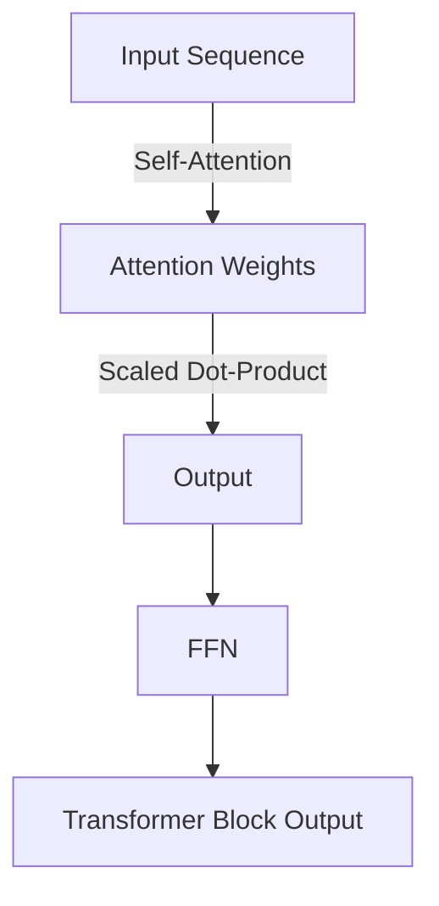
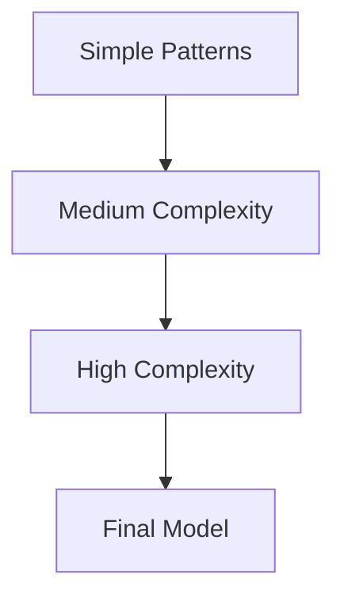
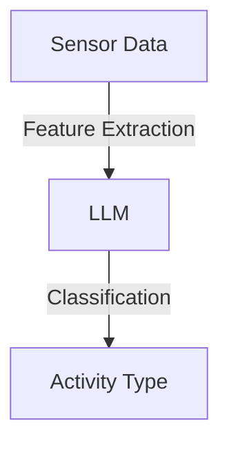

## Introduction

Training Large Language Models (LLMs) for time series motion sensor data involves adapting these models, typically used for text, to analyze and predict motion data. This guide outlines the key steps and considerations for this task.

---

## Key Considerations

### 1. **Data Preprocessing**

| Step | Description | Importance |
|------|-------------|------------|
| Normalization/Standardization | Scale data to handle varying ranges in sensor readings. | High |
| Handling Missing Data | Use interpolation or imputation to fill gaps. | Medium |
| Data Augmentation | Apply noise addition or temporal shifting to enhance robustness. | High |

### 2. **Model Adaptation**

- **Attention Mechanisms:** Utilize self-attention to capture temporal dependencies.
- **Transformer Architectures:** Consider using architectures like Time Series Transformers for sequential data handling.

### 3. **Evaluation Metrics**

| Metric | Description | Use Case |
|--------|-------------|----------|
| MAE (Mean Absolute Error) | Measures average prediction error. | Regression tasks |
| RMSE (Root Mean Square Error) | Provides a higher weight to larger errors. | Regression tasks |

### 4. **Challenges**

| Challenge | Solution |
|-----------|----------|
| Data Sparsity | Use data augmentation or transfer learning. |
| Interpretability | Implement attention visualization techniques. |

---

## Model Architecture

### 1. **Attention Mechanisms**

#### Self-Attention Diagram

### 2. **Sequential Processing**

| Model Type | Description | Strengths |
|------------|-------------|-----------|
| Recurrent Neural Networks (RNNs) | Process sequences step-by-step. | Handles sequential data. |
| Transformers | Use attention mechanisms for long-range dependencies. | Better performance on long sequences. |

---

## Training Strategies

### 1. **Curriculum Learning**

### 2. **Transfer Learning**

- Pretrain models on large datasets (e.g., general motion data).
- Fine-tune on specific tasks (e.g., activity recognition).

### 3. **Regularization Techniques**

| Technique | Description |
|-----------|-------------|
| Dropout | Randomly deactivate neurons during training. |
| Weight Decay | Regularize model weights to prevent overcomplexity. |

---

## Use Cases

### 1. **Activity Recognition**

### 2. **Anomaly Detection**

- Identify unusual patterns in motion data.
- Applications: Equipment failure prediction, safety monitoring.

### 3. **Predictive Maintenance**

- Forecast maintenance needs based on sensor trends.
- Applications: Industrial machinery, IoT devices.

---

## Future Directions

### 1. **Hybrid Models**

Combine LLMs with traditional time series models (e.g., ARIMA, LSTM) for enhanced performance.

### 2. **Real-Time Processing**

Develop lightweight models for real-time applications.

### 3. **Edge Computing**

Implement models on edge devices for low-latency applications.

---

## Conclusion

Adapting LLMs for time series motion sensor data opens new possibilities in analyzing and predicting motion patterns. By addressing challenges and leveraging advanced techniques, these models can provide valuable insights across various applications.

---
